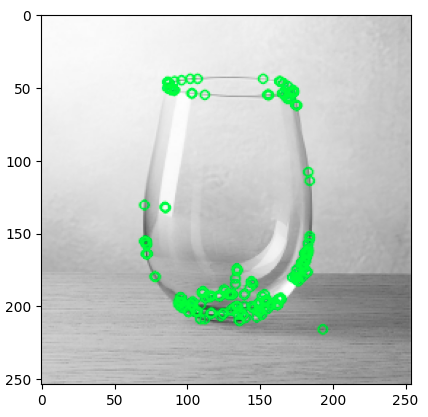

## Ejercicio de Micropython <a name="micro"></a>

**Machine Learning (ML)** es una rama de la inteligencia artificial que permite a las computadoras aprender de datos sin ser programadas explícitamente. Mediante algoritmos, los sistemas identifican patrones, hacen predicciones o toman decisiones basadas en información previa, mejorando su precisión con la experiencia. Se usa en aplicaciones como recomendaciones, reconocimiento de voz, diagnóstico médico y autos autónomos. En esencia, el ML transforma permite generar conocimiento a paritr del entendimiento de los datos.

La correspondencia de características es fundamental en muchos problemas de visión artificial, como el reconocimiento de objetos o la estructura a partir del movimiento. Los métodos actuales se basan en descriptores costosos para la detección y la correspondencia. En este artículo, proponemos un descriptor binario muy rápido basado en BRIEF, llamado ORB, que es invariante a la rotación y resistente al ruido. Demostramos mediante experimentos que ORB es dos órdenes de magnitud más rápido que SIFT, con un rendimiento similar en muchas situaciones. Su eficiencia se prueba en diversas aplicaciones del mundo real, incluyendo la detección de objetos y el seguimiento de parches en un teléfono inteligente.

**Ejemplo de uso:**

```python

#Se importa la clase creada en Micropython
from orb_detector import ORBDetector

orb = ORBDetector()

#el algoritmo tiene un método que recibe como párametro de entrada una imagen almacenada como array en un archivo .txt
key = orb.detectar_orb("insumos/imagen.txt")
key1 = orb.detectar_orb("insumos/imagen1.txt")

print("Total keypoints:", len(key))
print("Primeros 5 keypoints:", key[:5])
```

El algoritmo detecta los Keypoints de una imagen que puede ser usado para proyectos de automatización como el seguimiento de un objeto o encontrar un patrón que ya se le ha dado:

**Salida:**



#### Testeo del algoritmo en un espacio de simulación:

[Ir a Wokwi (simulador MicroPython)](https://wokwi.com/projects/432405849571279873)


